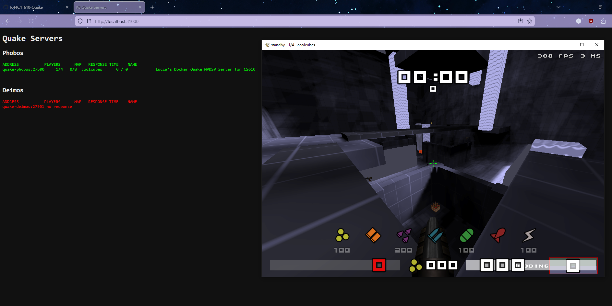

# IT610-FINAL-Project
### Created by Lucca Cioffi

## This is a Docker Quake Server Cluster with custom map loading, and a website that displays the server information of each running instance.

The Docker server pulls the [latest MVDSV](https://github.com/QW-Group/mvdsv/releases/latest/) and [latest ktx](https://github.com/QW-Group/ktx/releases/latest)

MVDSV is the actual server running, and KTX is what is used for the qwprogs.so file (game logic)

Since it is **illegal to distribute the pak1 file** as that is owned by iD Software, this upload contains a LibreQuake pak0 and pak1 instead. 

[Latest LibreQuake can be found here.](https://github.com/lavenderdotpet/LibreQuake/releases/latest)
It does NOT automatically pull new pak files if future LibreQuake releases come out.

If you want to use the official pak files, purchase Quake from a storefront such as Steam or GOG.

Steam: https://store.steampowered.com/app/2310/Quake/

GOG: https://www.gog.com/en/game/quake_the_offering

## Instructions:

# !!!IMPORTANT!!! 

#### Before you run this image and create a container, you need to supply your pak1.pak (if you purchased Quake) and any custom maps you would like to load. 
If you are loading a custom map, I highly recommend you modify the default server settings to load your map on launch.
```
basedir
|-/game-server
  |-/id1 (pak files, and server config)
    |-/maps (drop your custom maps here)
|-/kubernetes (contains deployment yaml)
|-/web (contains python flask site program for site information display)
```
#### Place your PAK files in /game-server/id1 like you would for a client installation of Quake

The server config is in /game-server/id1

Maps need to be in: /game-server/id1/maps

Once your files are placed where they need to be, navigate to the base directory where the Dockerfile is. You will need to rebuild the game server image if you have modified anything.

#### Build the images from each directory:
```
docker build -t lucca/quake:latest .\gameserver

docker build -t lucca/webstat:latest .\web
``` 

#### Run the deployment:
```
kubectl apply -f kubernetes\deploywithweb.yaml
```

To test your maps out, launch a QuakeWorld client (this was tested on ezQuake) and connect to the connection info the website status service displays.

You can get this with the following command in Docker Desktop. 
```
kubectl get svc quake-status
```

The web service by default runs on the exposed port of 31000 on the host kubernetes machine (5000 in the cluster itself), so you would connect to http://127.0.0.1:31000/ in your web browser.


By default, two servers (phobos and demios) are created. They expose their ports to 30000 and 30001 by default on the host (27500 and 27501 in the cluster itself).
This is because originally these were going to be connected to a LoadBalancer through services, before I pivoted to the website display page as something I could use while I develop more Quake maps.

You can do so by hitting the tilde key (~) to open the console, then run the command in ezQuake
```
connect localhost:30000
```
OR
```
connect localhost:30001
```
The status page auto-refreshes itself every 5 seconds, so you should then see a play having joined one of the servers! This makes them "live" updated, and if they are experiencing connection problems, they will display as red instead of green (i.e. when paused in Docker Desktop!) You could adjust this through the app.py in the web folder. You will need to rebuild the webstat image if you do so.

Enjoy and happy fragging!


